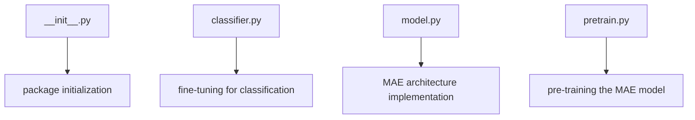

# Masked Autoencoder (MAE) on CIFAR10

## Introduction

This repository provides a simplified implementation of the Masked Autoencoder (MAE) architecture on the CIFAR10 dataset. The project is inspired by the work in [IcarusWizard/MAE](https://github.com/IcarusWizard/MAE) and includes extensive Chinese comments to facilitate understanding.


这个仓库提供了在 CIFAR10 数据集上 Masked Autoencoder (MAE) 架构的简化实现。该项目受到 IcarusWizard/MAE 工作的启发，并包含了大量的中文注释以便于理解。

## Overview

The MAE architecture is designed for self-supervised learning. It works by masking a significant portion of the input data and then reconstructing the original image using the visible patches. This process helps the model learn robust feature representations without the need for labeled data.

## Installation

To set up the environment for this project, you need Python 3.6 or higher and PyTorch 1.7 or higher. Install the required packages using pip:

```bash
pip install torch torchvision einops tqdm
```

## Usage

### Pre-training

To pre-train the MAE model on CIFAR10, execute the following command:

```bash
python pretrain.py
```

This command will initiate the pre-training process, which involves masking a large subset of image patches, encoding the visible patches, and then using a small decoder to reconstruct the original image.

### Classification

After pre-training, the encoder can be used for classification tasks on CIFAR10. To fine-tune the pre-trained encoder for classification, run:

```bash
python classifier.py
```

## Code Structure

```
.
├── __init__.py
├── classifier.py
├── model.py
└── pretrain.py
```

- **`__init__.py`**: Initialization file for the package.
- **`classifier.py`**: Script for fine-tuning the pre-trained encoder on classification tasks.
- **`model.py`**: Contains the implementation of the MAE architecture, including the encoder, decoder, and classification head.
- **`pretrain.py`**: Script for pre-training the MAE model on CIFAR10.

## Acknowledgements

This project is inspired by and heavily relies on the work done in [IcarusWizard/MAE](https://github.com/IcarusWizard/MAE). The original repository provides a more comprehensive implementation and additional features.

## License

This project is licensed under the MIT License. See the [LICENSE](LICENSE) file for details.

## Diagrams


### Code Structure Diagram



These diagrams provide a visual representation of the MAE architecture and the code structure, helping to understand the flow and components of the project.
